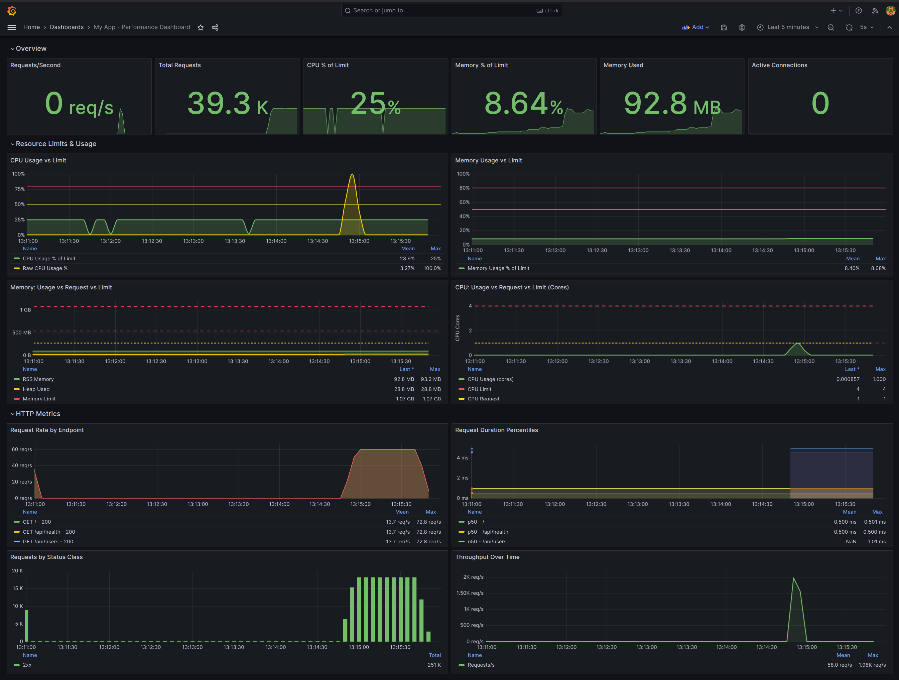

# my-app

A Bun API server with OpenTelemetry observability, Prometheus/Grafana monitoring, and comprehensive performance testing.

## Project Structure

```
.
├── assets/                   # Documentation assets
│   └── dash-view.png
├── k6/                       # k6 load testing scripts
│   ├── quick-test.js
│   ├── stress-test.js
│   ├── spike-test.js
│   ├── soak-test.js
│   └── load-test.js
├── my-app/
│   ├── src/
│   │   ├── index.ts          # API server entry point
│   │   ├── routes.json       # Route configuration
│   │   ├── handlers/         # Request handlers
│   │   │   ├── index.ts
│   │   │   ├── general.ts
│   │   │   ├── users.ts
│   │   │   └── types.ts
│   │   ├── telemetry/        # OpenTelemetry instrumentation
│   │   │   ├── index.ts
│   │   │   ├── metrics.ts
│   │   │   └── middleware.ts
│   │   └── __tests__/        # Test suites
│   │       ├── unit/
│   │       ├── integration/
│   │       └── performance/
│   ├── monitoring/           # Observability stack config
│   │   ├── prometheus/
│   │   │   └── prometheus.yml
│   │   └── grafana/
│   │       └── provisioning/
│   ├── .github/workflows/    # CI/CD
│   │   └── ci.yml
│   ├── Dockerfile            # Multi-stage production build
│   ├── docker-compose.yml    # Full stack deployment
│   ├── .dockerignore         # Docker build exclusions
│   ├── build.ts              # Bundle configuration
│   └── package.json
└── README.md
```

## Quick Start

### Option 1: Docker (Recommended)

Deploy the complete stack with one command:

```bash
cd my-app

# Build and start all services
bun run docker:up

# View logs
bun run docker:logs
```

Access the services:
- **API**: http://localhost:3000
- **Metrics**: http://localhost:9464/metrics
- **Prometheus**: http://localhost:9090
- **Grafana**: http://localhost:3030 (admin/admin)

### Option 2: Local Development

```bash
cd my-app

# Install dependencies
bun install

# Start development server
bun run dev
```

## Docker Deployment

### Container Architecture

```
┌─────────────────────────────────────────────────────────────┐
│                     Docker Network                          │
│                                                             │
│  ┌─────────────┐   ┌─────────────┐   ┌─────────────┐       │
│  │   my-app    │   │ prometheus  │   │   grafana   │       │
│  │             │   │             │   │             │       │
│  │  Port 3000  │──▶│  Port 9090  │──▶│  Port 3030  │       │
│  │  Port 9464  │   │             │   │             │       │
│  │             │   │             │   │             │       │
│  │ CPU: 4 core │   │ CPU: 0.5    │   │ CPU: 0.5    │       │
│  │ RAM: 1024MB │   │ RAM: 256MB  │   │ RAM: 256MB  │       │
│  └─────────────┘   └─────────────┘   └─────────────┘       │
│                                                             │
└─────────────────────────────────────────────────────────────┘
```

### Resource Allocation

| Service | CPU Limit | CPU Reserved | Memory Limit | Memory Reserved |
|---------|-----------|--------------|--------------|-----------------|
| **app** | 4.0 cores | 1.0 core | 1024 MB | 256 MB |
| **prometheus** | 0.5 core | 0.1 core | 256 MB | 64 MB |
| **grafana** | 0.5 core | 0.1 core | 256 MB | 64 MB |
| **Total** | 5.0 cores | 1.2 cores | 1536 MB | 384 MB |

### Docker Commands

| Command | Description |
|---------|-------------|
| `bun run docker:build` | Build the application image |
| `bun run docker:up` | Start all services |
| `bun run docker:down` | Stop all services |
| `bun run docker:logs` | View all logs |
| `bun run docker:logs:app` | View app logs only |
| `bun run docker:restart` | Restart the app container |
| `bun run docker:stats` | Show resource usage |

### Building the Image

```bash
# Build with docker compose
bun run docker:build

# Or build directly
docker build -t my-app .
```

### Running Individual Containers

```bash
# Run just the app
docker run -d \
  --name my-app \
  -p 3000:3000 \
  -p 9464:9464 \
  --cpus="4.0" \
  --memory="1024m" \
  my-app

# Check resource usage
docker stats my-app --no-stream
```

### Health Checks

The app container includes a health check that:
- Runs every 30 seconds
- Checks `/api/health` endpoint
- Times out after 5 seconds
- Retries 3 times before marking unhealthy
- Waits 10 seconds on startup

```bash
# Check container health
docker inspect --format='{{.State.Health.Status}}' my-app
```

### Production Considerations

For production deployments, consider:

1. **Secrets Management**: Use Docker secrets or environment variables for sensitive data
2. **Persistent Storage**: Mount volumes for Prometheus and Grafana data
3. **Reverse Proxy**: Add nginx or traefik for SSL termination
4. **Scaling**: Use Docker Swarm or Kubernetes for horizontal scaling
5. **Logging**: Configure log drivers for centralized logging

Example with external volumes:

```bash
docker compose -f docker-compose.yml up -d
```

## Scripts

### Application

| Command | Description |
|---------|-------------|
| `bun run dev` | Development with hot reload |
| `bun run start` | Run from source |
| `bun run build` | Bundle to `dist/` |
| `bun run serve` | Run bundled version |

### Testing

| Command | Description |
|---------|-------------|
| `bun test` | Run all tests |
| `bun test src/__tests__/unit` | Run unit tests only |
| `bun test src/__tests__/integration` | Run integration tests |
| `bun test src/__tests__/performance` | Run performance tests |

### k6 Load Testing

**With k6 installed locally (uses localhost:3000):**

| Command | Description |
|---------|-------------|
| `bun run k6:quick` | Quick 10s load test (50 VUs) |
| `bun run k6:stress` | Stress test (10-190 VUs ramp) |
| `bun run k6:spike` | Spike test (10x traffic burst) |
| `bun run k6:soak` | Soak/endurance test (3 min) |
| `bun run k6:full` | Full test suite (~4 min) |

**With Docker (no k6 installation needed, uses host.docker.internal:3000):**

| Command | Description |
|---------|-------------|
| `bun run k6:docker:quick` | Quick test via Docker |
| `bun run k6:docker:stress` | Stress test via Docker |
| `bun run k6:docker:spike` | Spike test via Docker |
| `bun run k6:docker:soak` | Soak test via Docker |
| `bun run k6:docker:full` | Full test via Docker |

**Custom BASE_URL:**

You can override the target URL using the `BASE_URL` environment variable:

```bash
# Native k6 with custom URL
BASE_URL=http://192.168.1.100:3000 k6 run k6/quick-test.js

# Docker k6 with custom URL
docker run --rm -i \
  -e BASE_URL=http://host.docker.internal:3000 \
  -v ./k6:/scripts \
  grafana/k6 run /scripts/quick-test.js
```

## API Endpoints

| Method | Endpoint | Description |
|--------|----------|-------------|
| GET | `/` | Welcome message |
| GET | `/api/health` | Health check with timestamp |
| GET | `/api/users` | List all users |
| POST | `/api/users` | Create a user |
| GET | `/api/users/:id` | Get user by ID |

## Examples

```bash
# Health check
curl http://localhost:3000/api/health

# Get all users
curl http://localhost:3000/api/users

# Get user by ID
curl http://localhost:3000/api/users/1

# Create a user
curl -X POST http://localhost:3000/api/users \
  -H "Content-Type: application/json" \
  -d '{"name": "John", "email": "john@example.com"}'
```

## Observability

### Metrics Endpoint

When the app is running, Prometheus metrics are exposed at:

```
http://localhost:9464/metrics
```

### Available Metrics

| Metric | Type | Description |
|--------|------|-------------|
| `http_requests_total` | Counter | Total HTTP requests by method, route, status |
| `http_request_duration_ms` | Histogram | Request latency (p50, p95, p99) |
| `http_errors_total` | Counter | Error count by endpoint |
| `http_requests_per_second` | Gauge | Real-time throughput |
| `http_active_connections` | Gauge | Current active connections |
| `process_cpu_usage_percent` | Gauge | Process CPU usage |
| `process_memory_heap_used_bytes` | Gauge | Heap memory used |
| `process_memory_heap_total_bytes` | Gauge | Total heap memory |
| `process_memory_rss_bytes` | Gauge | Resident set size |

### Monitoring Stack

The Docker deployment includes a pre-configured monitoring stack:



| Service | URL | Credentials |
|---------|-----|-------------|
| Application | http://localhost:3000 | - |
| Metrics | http://localhost:9464/metrics | - |
| Prometheus | http://localhost:9090 | - |
| Grafana | http://localhost:3030 | admin / admin |

Grafana comes pre-configured with:
- Prometheus data source (auto-provisioned)
- Performance dashboard with CPU, memory, throughput, latency panels

### Checking Resource Usage

```bash
# View container stats
bun run docker:stats

# Sample output:
# CONTAINER ID   NAME                CPU %     MEM USAGE / LIMIT   MEM %
# 1e21cc272f6b   my-app              0.01%     30.21MiB / 1GiB     3.01%
# c831e2c7c971   my-app-prometheus   0.36%     35.38MiB / 256MiB   13.82%
# 8bd4cad4b266   my-app-grafana      0.13%     97.19MiB / 256MiB   37.96%
```

## Testing

### Test Suites

**Unit Tests** (`src/__tests__/unit/`)
- Handler function tests in isolation
- Fast, no server startup required

**Integration Tests** (`src/__tests__/integration/`)
- Full API tests with real HTTP requests
- Tests routing, handlers, and error handling

**Performance Tests** (`src/__tests__/performance/`)
- Load tests (50 concurrent, 500 requests)
- Stress tests (ramping 10-190 concurrency)
- Spike tests (10x traffic burst with recovery)
- Soak tests (sustained load with memory monitoring)
- Memory leak detection

### Running Tests

```bash
# Run all tests
bun test

# Run specific test file
bun test src/__tests__/unit/users.test.ts

# Run tests matching pattern
bun test --test-name-pattern "health"
```

## k6 Load Testing

### Quick Test

Run a quick 10-second load test with 50 virtual users:

```bash
# Start the stack first
bun run docker:up

# Run k6 test
bun run k6:docker:quick
```

Sample output:
```
QUICK PERFORMANCE TEST RESULTS
======================================================================
Endpoint                     Avg (ms)    P50 (ms)    P95 (ms)    P99 (ms)
----------------------------------------------------------------------
GET /                            1.61         N/A        4.97         N/A
GET /api/health                  1.42         N/A        4.42         N/A
GET /api/users                   4.40         N/A       12.86         N/A
GET /api/users/:id               1.53         N/A        4.60         N/A
POST /api/users                  1.37         N/A        4.34         N/A
----------------------------------------------------------------------

Total Requests: 22535
Error Rate: 0.00%
Throughput: 2230.59 req/s
```

### Stress Test

Find the breaking point by ramping up load:

```bash
bun run k6:docker:stress
```

### Spike Test

Test system behavior under sudden traffic spikes:

```bash
bun run k6:docker:spike
```

The spike test runs three phases:
1. **Baseline**: 10 VUs for 15s
2. **Spike**: 100 VUs for 30s (10x increase)
3. **Recovery**: Back to 10 VUs for 15s

## Architecture

```
┌─────────────┐     ┌─────────────┐     ┌─────────────┐
│   Client    │────▶│  Bun Server │────▶│  Handlers   │
└─────────────┘     └──────┬──────┘     └─────────────┘
                           │
                    ┌──────▼──────┐
                    │  Telemetry  │
                    │  Middleware │
                    └──────┬──────┘
                           │
              ┌────────────┼────────────┐
              ▼            ▼            ▼
        ┌──────────┐ ┌──────────┐ ┌──────────┐
        │Prometheus│ │  Grafana │ │  Metrics │
        │  :9090   │ │  :3030   │ │  :9464   │
        └──────────┘ └──────────┘ └──────────┘
```

## License

MIT
